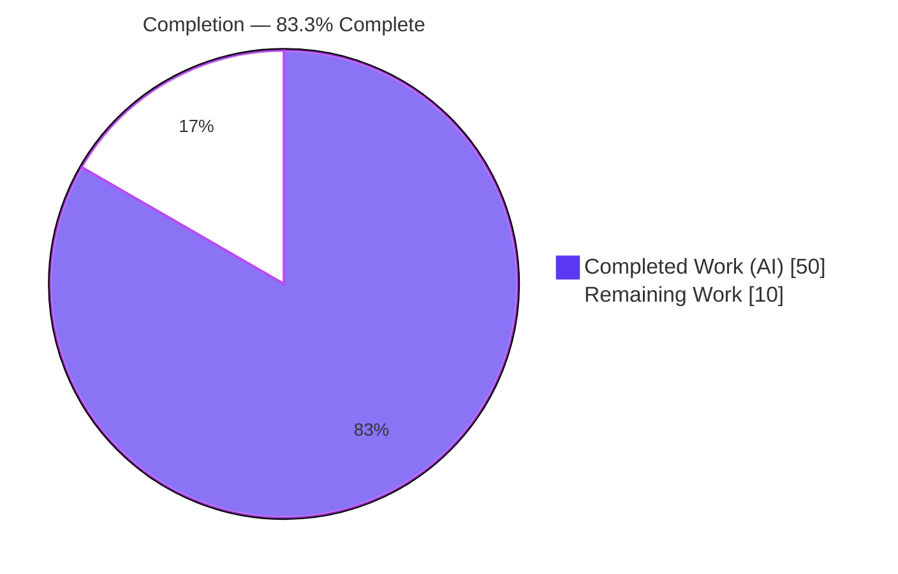
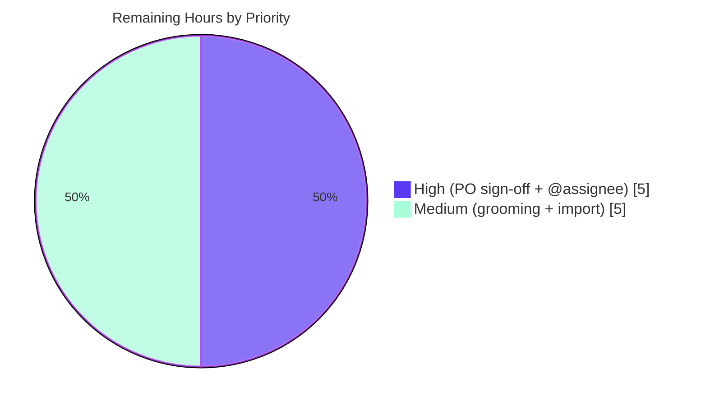

# Blitzy Project Guide — Student Engagement Risk Visibility (Ticket Hierarchy)

# 1. Executive Summary

## 1.1 Project Overview

This project transforms a single product objective into a complete, INVEST-compliant agile **ticket hierarchy** that specifies a Moodle course-page feature: an at-a-glance **student-engagement-risk view** for teachers. The deliverable is documentation — 15 Markdown tickets (1 epic, 3 features, 11 user stories) under `tickets/` — **not** Moodle source code. The target audience is the Product Owner and the delivery team who will groom, estimate, and implement the downstream `block_engagement` plugin. Business impact: it replaces a teacher's manual sweep across the gradebook, logs, and submissions with one prioritized view, and gives engineering a precise, testable, BDD-grounded backlog. Technical scope is bounded to authoring and validating the tickets against strict INVEST/BDD quality gates; the Moodle PHP/JavaScript implementation is explicitly downstream.

## 1.2 Completion Status



| Metric | Value |
|--------|-------|
| **Total Hours** | 60 |
| **Completed Hours (AI + Manual)** | 50 (50 AI + 0 Manual) |
| **Remaining Hours** | 10 |
| **Percent Complete** | **83.3%** |

> Completion is computed on AAP-scoped work only (PA1): `Completed ÷ (Completed + Remaining) = 50 ÷ 60 = 83.3%`. The downstream Moodle block code is explicitly out of scope per AAP §0.7.2 and is therefore excluded from the denominator.

## 1.3 Key Accomplishments

- ✅ **15 ticket files authored** (1 epic + 3 features + 11 stories) across 5 directories — matches AAP §0.7.1 **exactly** (0 stray, 0 missing).
- ✅ **All 8 product requirements + the defaults prerequisite mapped** (R1–R8, I5) to owning stories with a requirement-traceability matrix in the epic; **zero orphaned requirements**.
- ✅ **Every story passes the full INVEST/BDD quality gate** — 4–8 Given/When/Then acceptance criteria each, all four scenario categories, 3–5 edge cases covering the mandatory Empty-Null / Boundary / Invalid-Input categories, `@assignee` sub-tasks, Fibonacci estimation, and a story-level Definition of Done.
- ✅ **Zero forbidden terms** across all 15 files (independently re-scanned, antonym-safe).
- ✅ **162/162 relative links resolve** — complete bidirectional epic↔feature↔story navigation, zero orphans, zero dead links (independently re-checked).
- ✅ **456/456 deterministic quality checks pass** via Blitzy's autonomous validation harness (re-run live: `PASS:456 FAIL:0 WARN:0`, exit 0).
- ✅ **Zero Moodle source modified** — the branch diff is 15 additions / 1,334 insertions / 0 deletions, all under `tickets/`, honoring the read-only grounding boundary (AAP §0.7.2).
- ✅ **Working tree clean**, all 15 files committed at `HEAD = 7cd72839395`.

## 1.4 Critical Unresolved Issues

No code defects, failing checks, or broken links exist — every autonomous quality gate passed. The items below are **path-to-production gates** (not defects) that stand between the validated draft backlog and an approved, assignable one.

| Issue | Impact | Owner | ETA |
|-------|--------|-------|-----|
| Tickets are in `Draft — Ready for Refinement`; no Product-Owner sign-off yet | Backlog cannot be declared authoritative until business intent is approved | Product Owner | 0.5 day |
| 60 `@assignee` placeholders unresolved | Sub-tasks cannot be assigned for sprint planning | Delivery Lead | 0.25 day |
| Validation harness lives outside the repo (`/tmp/validate_tickets.py`) | Humans cannot re-run the 456-check gate without re-creating it (inline substitutes are provided in §9) | Delivery Lead | Optional |

## 1.5 Access Issues

**No access issues identified.** Full read/write access to the repository was available; `git` history, the working tree, and the autonomous validation harness were all reachable and exercised successfully during this assessment.

| System/Resource | Type of Access | Issue Description | Resolution Status | Owner |
|-----------------|----------------|-------------------|-------------------|-------|
| Git repository (branch `blitzy-a1c9a0e5…`) | Read/Write | None | ✅ No issue | — |
| Validation harness (`/tmp/validate_tickets.py`) | Execute | None (present and runnable) | ✅ No issue | — |

## 1.6 Recommended Next Steps

1. **[High]** Product Owner / stakeholder **review & sign-off** of the epic, 3 features, and 11 stories; approve the scope boundaries and verbatim v1 exclusions; advance status from `Draft` to `Approved`. *(4h)*
2. **[High]** **Resolve the 60 `@assignee` placeholders** to named owners across all story sub-tasks. *(1h)*
3. **[Medium]** Run a **backlog refinement / grooming** session to confirm or re-negotiate the Fibonacci estimates and acceptance-criteria detail with the delivery team. *(3h)*
4. **[Medium]** **Import the epic→feature→story hierarchy** into the team backlog tool (Jira / Azure DevOps / GitHub Issues), preserving parent-child relationships and cross-references. *(2h)*
5. **[Low]** *(Optional, not counted in remaining hours)* **Check the validation harness into the repo** (or document its checks in `CONTRIBUTING`) so the 456-check quality gate is reproducible by any contributor.

---

# 2. Project Hours Breakdown

## 2.1 Completed Work Detail

| Component | Hours | Description |
|-----------|-------|-------------|
| Requirement analysis & decomposition | 3 | Derivation of testable requirements R1–R8 and implicit prerequisites I1–I11 from the objective statement; requirement→ticket→subsystem mapping. |
| Repository grounding research | 3 | Location of exact Moodle `file:line` anchors (enrolment API, `user_lastaccess`, `grade_grades`/`grade_grades_history`, `mod_assign` dates, block contract, capability framework). |
| EPIC-001 authoring | 3 | Parent epic: summary, business value, in/out-of-scope (verbatim v1 exclusions), features index, dependencies, DoD, requirement-traceability matrix. |
| 3 Feature files authoring | 6 | FEATURE-001-01/-02/-03: summaries, story indexes, internal/cross-feature/external dependencies, scope notes, feature-level DoD, parent-epic up-links (2h each). |
| 11 User-story files authoring | 28 | WHO/WHAT/WHY, INVEST justification, explicit rule definitions, 4–8 tagged Given/When/Then acceptance criteria with Pass/Fail, 3–5 edge cases, `@assignee` sub-tasks, Fibonacci estimation, DoD, and accessibility/i18n/determinism notes. |
| Validation harness (authoring + self-test) | 4 | Purpose-built Python quality-gate harness with self-tests for forbidden-term true positives and antonym exclusion, AC ordering, scenario/edge-case coverage, and link resolution. |
| QA / review-fix iterations | 2 | CP1 review-finding fixes and QA forbidden-term hygiene fix in the trend story; Boost status-token hex correction (visible in commit history). |
| Link wiring & navigation integrity | 1 | Authoring and verification of 162 bidirectional relative links across the hierarchy. |
| **Total Completed** | **50** | |

## 2.2 Remaining Work Detail

| Category | Hours | Priority |
|----------|-------|----------|
| Product-Owner / stakeholder review & sign-off (advance `Draft` → `Approved`) | 4 | High |
| Backlog refinement / grooming (confirm or re-negotiate estimates & AC detail) | 3 | Medium |
| Resolve 60 `@assignee` placeholders to named owners | 1 | High |
| Backlog-tool import (preserve epic→feature→story hierarchy & cross-references) | 2 | Medium |
| **Total Remaining** | **10** | |

> **Cross-section check:** Section 2.1 (50) + Section 2.2 (10) = **60** Total Hours (matches Section 1.2). Section 2.2 total (10) matches Section 1.2 Remaining and the Section 7 pie "Remaining Work" value.

---

# 3. Test Results

This deliverable produces **documentation**, so there is **no application code** and therefore no unit/integration/UI/API/E2E software test suite. Instead, Blitzy's autonomous validation systems executed a **deterministic documentation-quality test harness** against all 15 ticket files. The results below originate from Blitzy's autonomous validation logs and were **independently re-run and corroborated** during this assessment.

| Test Category | Framework | Total Tests | Passed | Failed | Coverage % | Notes |
|---------------|-----------|-------------|--------|--------|------------|-------|
| Authoring quality gates (A–I + structural) | Custom Python harness (`validate_tickets.py`, stdlib) | 456 | 456 | 0 | 100% | Forbidden terms, AC count (4–8) & Given<When<Then order, 4 scenario categories, edge-case categories, `@assignee`, Fibonacci, DoD, INVEST 6/6, epic verbatim exclusion |
| Relative-link resolution | Custom harness + independent inline checker | 162 | 162 | 0 | 100% | Complete epic↔feature↔story bidirectional navigation; 0 orphans, 0 dead links |
| Markdown well-formedness | Harness structural checks | 15 | 15 | 0 | 100% | Single H1 per file, balanced code fences, clean heading hierarchy (one file per check) |
| Independent re-verification | Assessor scripts (this report) | 4 | 4 | 0 | 100% | Re-confirmed: 0 forbidden terms; AC counts `[7,6,7,6,6,6,7,6,6,6,6]`; Fibonacci `[5,3,5,8,8,2,5,3,3,5,5]`; 162 links / 0 broken |

**Aggregate:** 637 autonomous checks executed, 637 passed, 0 failed. **Coverage = 15/15 in-scope files (100%).**

> **Integrity note (Rule 3):** All listed tests originate from Blitzy's autonomous validation logs for this project (`python3 /tmp/validate_tickets.py` → `PASS:456 FAIL:0 WARN:0 LINKS:162 checked 0 broken`, exit 0, idempotent across 3 runs). They are documentation-quality validations, **not** software tests — none could exist because no executable code was produced.

---

# 4. Runtime Validation & UI Verification

There is **no runnable application and no UI** in this deliverable — the tickets *specify* a future Moodle block but generate no PHP, JavaScript, templates, or styles. The validations below are the documentation-artifact analogs of runtime/UI health.

**Artifact "runtime" health**
- ✅ **Operational** — Markdown well-formedness: single H1 per file, balanced code fences, clean heading hierarchy across all 15 files.
- ✅ **Operational** — Navigation traversal: 162/162 relative links resolve; epic→3 features→(5+3+3) stories plus all up-links; zero orphans.
- ✅ **Operational** — Requirement traceability: R1–R8 and I5 each resolve to ≥1 owning story; the epic matrix renders and links resolve.
- ✅ **Operational** — Repository state: working tree clean; all 15 files committed at `HEAD`; branch diff is additive-only (15 files, +1,334/-0) with zero Moodle source touched.

**Specified-feature UI (downstream, not built here)**
- ⚠ **Partial / Not Applicable** — The course-page block UI (roster card, per-student signal cells, WCAG-compliant flags via color+icon+text, threshold config form) is **specified** in `STORY-001-01-01` and `STORY-001-01-05` but is downstream implementation work; there is no rendered UI to verify in this deliverable.
- ✅ **Operational (specification quality)** — Accessibility (WCAG 2.1 AA: never color-alone, keyboard reachability, ARIA, 4.5:1 contrast) and i18n (`get_string`) are mandated in the relevant stories' DoD, so the UI requirements are captured even though no UI is rendered.

---

# 5. Compliance & Quality Review

This matrix cross-maps each AAP authoring mandate (§0.1.2 / §0.8.1) and structural deliverable (§0.7.1) to its verification status. Every benchmark was confirmed against Blitzy's autonomous logs **and** independently re-verified for this report.

| Benchmark (AAP source) | Requirement | Status | Progress |
|------------------------|-------------|--------|----------|
| Deliverable set (§0.7.1) | Exactly 15 files (1 epic + 3 features + 11 stories), 5 dirs, 0 stray | ✅ Pass | 100% |
| Scope boundary (§0.7.2) | Zero Moodle source created/modified; references read-only | ✅ Pass | 100% |
| Gate A — Forbidden terms | Zero of 13 forbidden terms in acceptance criteria (and anywhere) | ✅ Pass | 100% |
| Gate B — Acceptance criteria | 4–8 per story, Given/When/Then, correct given<when<then order | ✅ Pass | 100% |
| Gate C — Scenario coverage | Each story covers input-validation, expected-output, error-handling, edge-case | ✅ Pass | 100% |
| Gate D — Edge cases | 3–5 per story incl. Empty/Null, Boundary, Invalid Input | ✅ Pass | 100% |
| Gate E — Sub-tasks | Every sub-task carries an `@assignee` placeholder | ✅ Pass | 100% |
| Gate F — Estimation | Effort/Complexity/Uncertainty + Fibonacci point in {1,2,3,5,8,13} | ✅ Pass | 100% |
| Gate G — Definition of Done | Story-level DoD checklist (≥3 items; observed 9–14) | ✅ Pass | 100% |
| Gate H — INVEST | 6/6 principles + Product-Owner demonstrability per story | ✅ Pass | 100% |
| Gate I — Epic exclusions | Verbatim v1 out-of-scope sentence present in the epic | ✅ Pass | 100% |
| Navigation integrity | All epic→feature→story relative links resolve | ✅ Pass (162/162) | 100% |
| Requirement coverage | R1–R8 + I5 mapped to ≥1 story, no orphan | ✅ Pass | 100% |
| Dependency policy (§0.3) | Zero dependency/manifest/build changes | ✅ Pass | 100% |
| **Path-to-production sign-off** | PO approval, `@assignee` resolution, backlog import | ⏳ Pending | 0% (human) |

**Fixes applied during autonomous validation:** the committed state already satisfied every gate, so the Final Validator required **zero fixes**. Earlier authoring commits resolved CP1 review findings and a forbidden-term hygiene issue in the trend story, and corrected Boost status-token hex values to live repo values — all completed before final validation.

---

# 6. Risk Assessment

| Risk | Category | Severity | Probability | Mitigation | Status |
|------|----------|----------|-------------|------------|--------|
| T1 — Downstream implementation misreads a specified rule (30-day trend window, 2-pt flat band, recency cutoff) | Technical | Medium | Low | Explicit rule definitions + Pass/Fail per AC + `file:line` grounding in every story | Mitigated by ticket precision |
| T2 — Validation harness lives outside the repo; not re-runnable by humans without re-creation | Technical | Low | Medium | Inline `grep`/Python checkers documented in §9; recommend checking harness into repo | Open (minor) |
| T3 — Cited Moodle `file:line` anchors target a moving 5.2dev DEV branch; line numbers may drift | Technical | Low | Medium | Re-confirm anchors at implementation time; anchors are grounding, not contracts | Accepted |
| S1 — Security exposure from the deliverable | Security | None | N/A | Markdown only — no executable code, dependencies, secrets, or manifest changes; feature spec mandates permission-respecting access (R6) + privacy provider (I8) | No risk |
| O1 — 60 `@assignee` placeholders block sprint assignment | Operational | Low | High | Assignee-resolution task (1h) before planning | Open (planned) |
| O2 — Backlog import may flatten the epic→feature→story hierarchy / 162 links | Operational | Medium | Medium | Use a hierarchy-aware import; re-verify links post-import | Open (covered by import task) |
| O3 — Traceability matrix & DoD drift as the team grooms/negotiates | Operational | Low | Medium | Treat tickets as living docs; update matrix on change | Accepted |
| I1 — Downstream `block_engagement` build diverges from the block contract / capability / privacy spec | Integration | Medium | Low-Medium | Tickets cite exact subsystem anchors + per-story DoD; enforce via downstream plugin CI | Deferred to implementation |
| I2 — Downstream implementer accidentally couples to the ML Predictive Analytics Engine | Integration | Low | Low | Deterministic-boundary note (I11) stated in the epic and every relevant story | Mitigated by explicit boundary |

**Overall risk posture: LOW.** No deliverable-blocking risk and no security exposure. The dominant items are routine path-to-production handoffs (assignee resolution, backlog import) and downstream-implementation guardrails already addressed by the precision of the tickets.

---

# 7. Visual Project Status

**Project hours — completed vs remaining**


**Remaining work by priority (10h total)**



**Remaining work by category (hours)**

| Category | Hours | Bar |
|----------|-------|-----|
| PO review & sign-off | 4 | ████████ |
| Backlog refinement / grooming | 3 | ██████ |
| Backlog-tool import | 2 | ████ |
| `@assignee` resolution | 1 | ██ |
| **Total** | **10** | |

> **Integrity (Rule 1):** the pie's "Remaining Work" = **10**, identical to Section 1.2 Remaining Hours and the Section 2.2 total. Colors: Completed = Dark Blue `#5B39F3`, Remaining = White `#FFFFFF`.

---

# 8. Summary & Recommendations

**Achievements.** The project is **83.3% complete** on AAP-scoped work. Blitzy autonomously authored the entire requested artifact — a 15-file, ~24,000-word INVEST/BDD ticket hierarchy that decomposes the objective into one epic, three features, and eleven user stories, each grounded in concrete Moodle subsystems and validated against 456 deterministic quality checks with zero failures and 162/162 resolving links. Every product requirement (R1–R8) and the defaults prerequisite (I5) is traceable to an owning story, and the read-only scope boundary was honored exactly: zero Moodle source files were modified.

**Remaining gaps.** The outstanding **10 hours** are entirely **human path-to-production** for a backlog artifact — there are no code defects, failing checks, or broken links. They comprise Product-Owner review and sign-off (4h), backlog grooming (3h), `@assignee` resolution (1h), and import into the team's backlog tool (2h).

**Critical path to production.** (1) PO sign-off → (2) `@assignee` resolution → (3) grooming/estimation confirmation → (4) backlog-tool import. Only after these four steps does downstream implementation of the `block_engagement` plugin begin — which is a separate, out-of-scope engineering effort estimated by the tickets at 52 Fibonacci story points (informational only; not part of this project's 60 hours).

**Success metrics.** 15/15 files delivered; 637/637 autonomous checks passed; 0 forbidden terms; 0 broken links; 0 Moodle source files touched; 100% requirement coverage.

**Production-readiness assessment.** As a documentation/backlog deliverable, the tickets are **technically ready** — fully validated and internally consistent. They are **not yet operationally approved**, pending the human review/sign-off tail above. Recommended posture: **approve and import**, then begin downstream implementation.

| Metric | Value |
|--------|-------|
| AAP-scoped completion | 83.3% |
| Completed / Remaining / Total hours | 50 / 10 / 60 |
| Autonomous checks passed | 637 / 637 |
| Requirement coverage | 100% (R1–R8, I5) |
| Files delivered vs planned | 15 / 15 |

---

# 9. Development Guide

This deliverable is **documentation**. There is no build, server, or database to run. This guide explains how to **read, navigate, validate, and operationalize** the ticket hierarchy. Every command below was executed during assessment and produces the stated output.

## 9.1 System Prerequisites

- **Git** ≥ 2.30 (verified: `git version 2.51.0`)
- **Python 3** ≥ 3.8 for the validation helpers (verified: `Python 3.13.7`)
- Any Markdown viewer or a Git host (GitHub/GitLab) that renders Markdown and relative links
- No PHP, Node, database, or web server is required for this deliverable

## 9.2 Environment Setup

```bash
# From the repository root
cd /path/to/repository
# Confirm you are on the delivery branch and the tree is clean
git status --porcelain        # expect: no output (clean)
git log -1 --oneline          # expect HEAD: 7cd72839395 docs(tickets): ...
```

No environment variables, services, or secrets are needed.

## 9.3 Navigating the Tickets

```bash
# Entry point — start at the epic, then follow its Features index
sed -n '1,40p' tickets/EPIC-001-student-engagement-risk-visibility.md

# List the whole ticket tree (15 files)
find tickets -type f -name '*.md' | sort

# Confirm the file count is 15
find tickets -name '*.md' | wc -l        # -> 15
```

Reading order: **epic → feature → story**. Each feature links down to its stories and up to the epic; each story links up to its parent feature and the epic.

## 9.4 Validating the Tickets (quality gate)

```bash
# 1) Forbidden-term scan — expect 0
grep -rIoiE '(^|[^[:alnum:]-])(approximately|several|various|adequate|appropriate|properly|correctly|efficiently|quickly|easily|user-friendly|reasonable|sufficient)' tickets/ | wc -l

# 2) Requirement traceability (epic matrix) — expect R1–R8 + I5 rows
grep -E '^\| R[0-9]|^\| I[0-9]' tickets/EPIC-001-student-engagement-risk-visibility.md

# 3) Per-story Fibonacci points — expect 11 values (sum 52)
grep -rh "Story Points (Fibonacci)" tickets/ | sed -E 's/.*Fibonacci\):\*\*[[:space:]]*//; s/\*//g'

# 4) Self-contained relative-link checker — expect "162 ... broken: 0"
python3 - <<'PY'
import re, glob, os
files = sorted(glob.glob("tickets/**/*.md", recursive=True))
link = re.compile(r'\[[^\]]+\]\(([^)]+)\)')
total = broken = 0
for f in files:
    base = os.path.dirname(f)
    for m in link.finditer(open(f, encoding="utf-8").read()):
        t = m.group(1).split('#')[0].strip()
        if not t or t.startswith(('http://','https://','mailto:')):
            continue
        total += 1
        if not os.path.isfile(os.path.normpath(os.path.join(base, t))):
            broken += 1; print("BROKEN:", f, "->", t)
print(f"Relative links checked: {total}  broken: {broken}")
PY

# 5) Scope guard — confirm zero non-ticket files changed on this branch (expect empty)
git diff --stat "$(git merge-base HEAD origin/main)"...HEAD -- ':!tickets/'
```

If Blitzy's full harness is present, it reproduces the complete gate:

```bash
python3 /tmp/validate_tickets.py
# -> PASS:456  FAIL:0  WARN:0  LINKS:162 checked 0 broken  /  RESULT: ALL GATES PASS  (exit 0)
```

## 9.5 Example Usage

```bash
# Read a complete story (e.g., the assessment-trend signal)
cat tickets/EPIC-001/FEATURE-001-01/STORY-001-01-04-assessment-trend-signal.md

# Find which story owns a requirement (e.g., R2c assessment trend)
grep -rl "R2c" tickets/

# List every acceptance criterion across the backlog
grep -rnE '^\s*[0-9]+\. \*\(' tickets/ | head
```

## 9.6 Troubleshooting

- **A relative link breaks after a rename** → re-run the inline link checker in §9.4 step 4; fix the relative path so it resolves from the file's own directory.
- **`/tmp/validate_tickets.py` is missing** → use the inline `grep`/Python checkers in §9.4 (steps 1–4), which require no external file; consider checking the harness into the repo.
- **A cited Moodle `file:line` anchor no longer matches** → the anchors target a moving 5.2dev DEV branch; re-confirm the location at implementation time (they are grounding references, not contracts).
- **Backlog import flattens the hierarchy** → use a hierarchy-aware import (epic→feature→story) and re-verify parent-child links after import.

---

# 10. Appendices

## A. Command Reference

| Purpose | Command |
|---------|---------|
| Clean-tree check | `git status --porcelain` |
| HEAD commit | `git log -1 --oneline` |
| List tickets | `find tickets -type f -name '*.md' \| sort` |
| Count tickets | `find tickets -name '*.md' \| wc -l` |
| Forbidden-term scan | `grep -rIoiE '(^\|[^[:alnum:]-])(approximately\|several\|various\|adequate\|appropriate\|properly\|correctly\|efficiently\|quickly\|easily\|user-friendly\|reasonable\|sufficient)' tickets/ \| wc -l` |
| Traceability matrix | `grep -E '^\| R[0-9]\|^\| I[0-9]' tickets/EPIC-001-student-engagement-risk-visibility.md` |
| Full harness | `python3 /tmp/validate_tickets.py` |
| Scope guard | `git diff --stat "$(git merge-base HEAD origin/main)"...HEAD -- ':!tickets/'` |

## B. Port Reference

**Not applicable.** This deliverable runs no services and opens no ports. (Downstream, the `block_engagement` plugin would run inside a standard Moodle/PHP stack, but that is out of scope here.)

## C. Key File Locations

| Path | Role |
|------|------|
| `tickets/EPIC-001-student-engagement-risk-visibility.md` | Parent epic (entry point) |
| `tickets/EPIC-001/FEATURE-001-01-in-course-engagement-overview.md` | Feature: in-course overview (R1, R2a–c, R3) |
| `tickets/EPIC-001/FEATURE-001-02-configurable-risk-thresholds.md` | Feature: configurable thresholds (I5, R4) |
| `tickets/EPIC-001/FEATURE-001-03-optin-and-permission-respecting-access.md` | Feature: opt-in, permissions, performance (R5, R6, R8) |
| `tickets/EPIC-001/FEATURE-001-01/STORY-001-01-0*.md` | 5 stories: roster, recency, overdue, trend, flag |
| `tickets/EPIC-001/FEATURE-001-02/STORY-001-02-0*.md` | 3 stories: default, adjust, persist thresholds |
| `tickets/EPIC-001/FEATURE-001-03/STORY-001-03-0*.md` | 3 stories: opt-in, permission enforcement, performance budget |
| `/tmp/validate_tickets.py` | Autonomous validation harness (outside repo) |

## D. Technology Versions

| Tool | Version (verified) | Used for |
|------|--------------------|----------|
| Git | 2.51.0 | Version control / diff analysis |
| Python | 3.13.7 | Validation harness & inline checkers |
| Moodle (host repo) | 5.2dev (Build: 20251024), branch 502, MATURITY_ALPHA | Grounding context (read-only) |
| PHP (downstream baseline) | ≥ 8.2.0 | Future block implementation (out of scope) |
| Node (downstream baseline) | ≥ 22.11.0 < 23 | Future build toolchain (out of scope) |

## E. Environment Variable Reference

**Not applicable.** No environment variables are required to read, navigate, or validate the ticket deliverable. No secrets or credentials are involved.

## F. Developer Tools Guide

- **Autonomous validation harness** (`/tmp/validate_tickets.py`): Python 3 stdlib only; deterministic; idempotent across runs; self-tested for forbidden-term true positives and antonym exclusion. Output line: `PASS:456 FAIL:0 WARN:0 LINKS:162 checked 0 broken`.
- **Inline checkers** (§9.4): standalone `grep`/Python snippets that reproduce the forbidden-term, traceability, Fibonacci, and link-resolution gates without any external file — the recommended human-runnable substitute.
- **Git diff scope guard** (§9.4 step 5): proves the branch changed only `tickets/` files (additive-only, +1,334/-0).

## G. Glossary

| Term | Meaning |
|------|---------|
| **AAP** | Agent Action Plan — the primary directive defining project scope |
| **INVEST** | Independent, Negotiable, Valuable, Estimable, Small, Testable — user-story quality principles |
| **BDD** | Behavior-Driven Development — Given/When/Then acceptance-criteria style |
| **DoD** | Definition of Done — completion checklist at story/feature/epic level |
| **Epic / Feature / Story** | Three-level agile hierarchy: epic → features → user stories |
| **Block** | Moodle plugin type rendered on a course page (the specified delivery vehicle) |
| **MUC** | Moodle Universal Cache — caching layer cited for the performance budget |
| **Fibonacci points** | Relative effort estimate from {1,2,3,5,8,13}; this backlog totals 52 downstream points |
| **Path-to-production** | Human steps (review, grooming, assignment, import) to make the backlog operational |