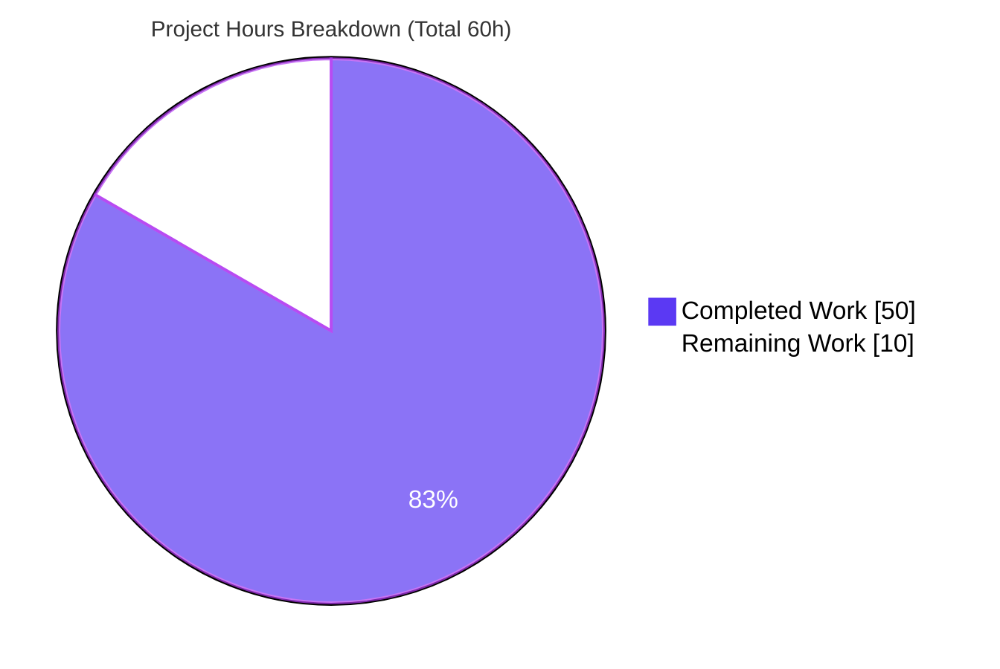
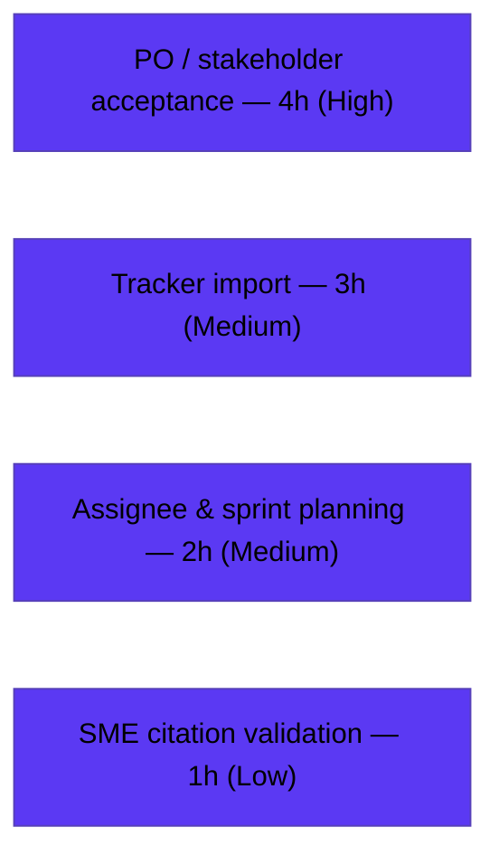

# Blitzy Project Guide — Class Pulse Agile Ticket Tree

> **Deliverable type:** Documentation only (agile planning artifacts). No Moodle source code is created or modified by this work — the Class Pulse block plugin is the *subject* the tickets describe, not an output. Standard compile/test/deploy gates are reported against their **documentation analogs**: structural validation ≈ "compile", content-quality gates ≈ "tests", Markdown render + cross-link navigation ≈ "run".

---

## 1. Executive Summary

### 1.1 Project Overview

This project transforms a single product Objective Statement — the specification for a new **"Class Pulse"** Moodle course block — into a complete, traceable hierarchy of agile planning artifacts authored as plain Markdown under a new `tickets/` directory. Authored in the persona of a User Story Analyst, the deliverable is one parent **Epic**, three child **Features**, and fourteen child **User Stories** that decompose the Class Pulse behavior (per-student engagement signals, teacher-configurable risk thresholds, and course-profile click-through) into independently implementable, INVEST-compliant stories with BDD (Given/When/Then) acceptance criteria. The target audience is the Moodle plugin development team and the Product Owner who will accept and operationalize the backlog. No executable code is produced; every artifact is plain Markdown grounded in the Moodle 5.2dev codebase.

### 1.2 Completion Status


| Metric | Hours |
|--------|-------|
| **Total Hours** | **60** |
| **Completed Hours (AI + Manual)** | **50** |
| &nbsp;&nbsp;— AI (autonomous) | 50 |
| &nbsp;&nbsp;— Manual (human) | 0 |
| **Remaining Hours** | **10** |
| **Percent Complete** | **83.3%** |

> **Completion formula (PA1, AAP-scoped):** `50 ÷ (50 + 10) × 100 = 83.3%`. The completion percentage measures autonomous work delivered against the Agent Action Plan plus the standard path-to-production activities required to operationalize a planning-artifact deliverable.

### 1.3 Key Accomplishments

- ✅ **All 18 artifacts authored** — 1 Epic + 3 Features + 14 User Stories, exactly matching the AAP file plan (1,825 lines, ~24,558 words).
- ✅ **Strict structure & naming** — `EPIC-001` / `FEATURE-001-NN` / `STORY-001-NN-SS` with kebab-case slugs; correct directory hierarchy; 100% conformance.
- ✅ **Full INVEST + BDD compliance** — every story carries a concrete named actor, 4–8 Given/When/Then criteria with required coverage, 3–5 edge cases, Fibonacci estimation (39 points total), and a story-level Definition of Done.
- ✅ **Zero forbidden terms** in any Acceptance Criteria section (section-scoped scan = 0 hits).
- ✅ **Complete traceability & navigation** — 14/14 requirement facets mapped; 4/4 non-functional constraints documented; 79/79 relative cross-links resolve.
- ✅ **Grounded citations** — every subject-matter claim references a real Moodle 5.2dev path (`block_accessreview`, `version.php`, `mod/assign`, `mod/quiz`, `report/log`, `lib/db/install.xml`).
- ✅ **Render-clean** — all 18 files render to valid HTML (27 tables); visually confirmed in-browser.
- ✅ **Committed** — 22 commits on branch `blitzy-33d73a0c-...-e5677e969272`; `tickets/` tracked and clean.

### 1.4 Critical Unresolved Issues

| Issue | Impact | Owner | ETA |
|-------|--------|-------|-----|
| _None_ | No blocking defects exist. All AAP authoring, quality, and validation gates pass; `git diff` shows 18 files added / 0 deleted; validation harness reports 0 failures. | — | — |

> There are **no critical unresolved issues**. The only outstanding work is the human-in-the-loop path to production tracked in Sections 1.6, 2.2, and the human task list.

### 1.5 Access Issues

| System/Resource | Type of Access | Issue Description | Resolution Status | Owner |
|-----------------|----------------|-------------------|-------------------|-------|
| _None_ | — | No access issues identified. The deliverable is plain Markdown in the repository tree; no external services, credentials, or third-party APIs are required to author, validate, or review it. | N/A | — |

**No access issues identified.**

### 1.6 Recommended Next Steps

1. **[High]** Product Owner reviews and accepts the Epic, 3 Features, and 14 Stories against INVEST principles and the Given/When/Then acceptance criteria.
2. **[High]** Stakeholders sign off on the documented scope boundaries and v1 exclusions (notifications, parent visibility, cross-course aggregation, predictive modeling, configurable signal selection).
3. **[Medium]** Import the 18 artifacts into the team issue tracker, recreating the Epic→Feature→Story hierarchy and converting relative `.md` links into tracker parent/child relationships.
4. **[Medium]** Replace `@assignee` placeholders with named engineers and confirm Fibonacci estimates against the team's sizing convention during backlog grooming.
5. **[Low]** A Moodle SME re-validates the cited repository paths/line numbers and block-API contract against the target Moodle build before development begins.

---

## 2. Project Hours Breakdown

### 2.1 Completed Work Detail

All completed hours are autonomous (AI) authoring, quality-enforcement, and validation work. Each component traces to AAP-specified deliverables.

| Component | Hours | Description |
|-----------|------:|-------------|
| Repository analysis & Moodle subsystem grounding | 4.0 | Analyzed `block_accessreview` (contract analog), `db/access.php` (capabilities), `privacy/provider.php`, and the 4 signal sources (`user.lastlogin`, `mod/assign`, `mod/quiz`, `report/log`) to ground every citation (AAP 0.2.2). |
| Epic artifact authoring (`EPIC-001`) | 2.5 | Title, summary, business value, scope boundaries (4 constraints + 5 v1 exclusions), Features Index, dependencies, epic-level Definition of Done, citations. |
| Feature artifacts authoring (3 Features) | 6.0 | FEATURE-001-01/-02/-03: summary, scope boundaries, User Stories Index, dependencies, feature-level DoD, citations, Epic back-link. |
| FEATURE-001-01 stories (4) | 8.0 | Scaffold skeleton, access capabilities, course placement, privacy provider — full INVEST/BDD story template each. |
| FEATURE-001-02 stories (5) | 9.0 | Enrolled-student roster + four read-only engagement signals (last-login, overdue-assignments, quiz-trend, last-interaction). |
| FEATURE-001-03 stories (5) | 10.0 | Render table, threshold config form, color-coding, client-side sort/filter, student-profile link (largest stories, 123–136 lines). |
| INVEST + BDD quality enforcement | 3.0 | Forbidden-terms elimination, Given/When/Then coverage (input-validation/valid-output/error-handling/edge-boundary), edge-case design, concrete-actor assignment across all 14 stories. |
| Traceability, cross-artifact linking & naming | 2.0 | Requirement-to-story mapping, 79 resolving relative links, kebab-case naming convention. |
| Iterative review-finding resolution | 3.0 | Multiple documented review cycles (citation/verbatim/placement fixes; visualization-core F1–F4; final-checkpoint F1–F3). |
| Structural / render / link validation | 2.5 | Exact-18-file-set check, HTML render of all 18, 79/79 link resolution, markdown well-formedness, forbidden-terms scan. |
| **Total Completed** | **50.0** | **Matches Completed Hours in Section 1.2** |

### 2.2 Remaining Work Detail

All remaining work is the human-in-the-loop path to production for planning artifacts; no autonomous authoring remains.

| Category | Hours | Priority |
|----------|------:|----------|
| Product Owner / stakeholder review & acceptance of Epic + 3 Features + 14 Stories | 4.0 | High |
| Ticket import into the team issue tracker (hierarchy + cross-link mapping) | 3.0 | Medium |
| Assignee assignment & backlog/sprint planning (replace `@assignee`, confirm sizing) | 2.0 | Medium |
| Moodle SME validation of grounded citations before development | 1.0 | Low |
| **Total Remaining** | **10.0** | **Matches Remaining Hours in Section 1.2 & Section 7** |

> **Cross-section check:** Section 2.1 (50h) + Section 2.2 (10h) = **60h** = Total Hours in Section 1.2. ✓

---

## 3. Test Results

> For a documentation deliverable, "tests" are the **content-quality, structural, and render-validation gates** executed by Blitzy's autonomous validation system (and independently re-confirmed in this assessment). All results below originate from Blitzy's autonomous validation logs for this project.

| Test Category | Framework | Total Tests | Passed | Failed | Coverage % | Notes |
|---------------|-----------|------------:|-------:|-------:|-----------:|-------|
| Structural validation (file set, hierarchy) | Custom Python harness (`master_validate.py`) | 18 | 18 | 0 | 100% | Exact 18-file set matches AAP 0.4.1; correct directory nesting |
| Naming-convention validation | Regex check | 18 | 18 | 0 | 100% | All conform to `EPIC-001` / `FEATURE-001-NN` / `STORY-001-NN-SS` + kebab-case |
| Markdown render | markdown-it-py 4.2.0 | 18 | 18 | 0 | 100% | All render to clean HTML; 27 tables; zero parse errors |
| Cross-link resolution | Custom Python harness | 79 | 79 | 0 | 100% | Every Epic→Feature→Story relative `.md` link resolves |
| Story content-quality gates | Custom Python + grep | 14 | 14 | 0 | 100% | INVEST, 4–8 G/W/T criteria, required coverage, 3–5 edge cases, named actor, estimation, DoD, citations |
| Forbidden-terms scan (Acceptance Criteria) | Section-scoped Python/grep | 14 | 14 | 0 | 100% | 0 forbidden terms in any Acceptance Criteria section |
| Markdown well-formedness | Custom checks | 18 | 18 | 0 | 100% | H1 present, EOF newline, balanced code fences, no trailing whitespace |
| **Aggregate** | — | **179** | **179** | **0** | **100%** | Master harness: "ALL GATES PASS" — 0 failures |

> **Integrity note:** every test above is sourced from Blitzy's autonomous validation logs (Gates 1–5) and was re-executed during this assessment with identical results (18/18 render, 79/79 links, 0 failures).

---

## 4. Runtime Validation & UI Verification

> "Runtime" for a Markdown deliverable is **render fidelity and cross-document navigation**.

- ✅ **Operational** — Markdown render: all 18 ticket files render to valid HTML with zero parse errors (markdown-it-py 4.2.0).
- ✅ **Operational** — Table rendering: 27 Markdown tables render correctly across the tree (indexes, estimation tables, traceability tables).
- ✅ **Operational** — Navigation: 79/79 relative cross-links resolve; Epic → 3/3 Features; Features → 4/4 + 5/5 + 5/5 Stories; every Story → parent Feature back-link.
- ✅ **Operational** — Visual confirmation: rendered output reviewed in Chrome; evidence screenshots captured (`blitzy/screenshots/epic001_rendered_top.png`, `story_001_02_03_rendered.png`).
- ➖ **Not applicable** — API integration / service health: the deliverable is static Markdown with no runtime services, endpoints, or databases (AAP 0.9 specifies no build/preview/deploy step).

---

## 5. Compliance & Quality Review

Cross-mapping of AAP deliverables and rules to quality benchmarks. Fixes were applied during autonomous authoring (review-finding resolution commits); the final validation pass required **zero** additional fixes.

| Benchmark (AAP rule) | Status | Progress | Evidence |
|----------------------|--------|----------|----------|
| File structure & naming convention (0.1.2, 0.10) | ✅ PASS | 100% | 18/18 conform; 5 directories correct |
| One Epic → 1–3 Features → 2–5 Stories per Feature (0.10) | ✅ PASS | 100% | 1 Epic, 3 Features, 4/5/5 Stories |
| INVEST compliance per story (0.7.2) | ✅ PASS | 100% | All 14 stories explicitly address INVEST |
| BDD acceptance criteria, 4–8 Given/When/Then (0.7.3) | ✅ PASS | 100% | Required coverage (input-validation, valid-output, error-handling, edge/boundary) in every story |
| Zero forbidden terms in acceptance criteria (0.1.2) | ✅ PASS | 100% | Section-scoped scan = 0 hits |
| Concrete named actor — no generic "user" (0.1.2) | ✅ PASS | 100% | Moodle Plugin Developer, Site Administrator/manager, Course Teacher, Data Protection Officer |
| 3–5 edge cases per story (0.7.3) | ✅ PASS | 100% | 4–5 edge cases each (Empty/Null, Boundary, Invalid, Concurrent) |
| Fibonacci estimation + Effort/Complexity/Uncertainty (0.7.3) | ✅ PASS | 100% | 39 points total (5×2 + 8×3 + 1×5) |
| Definition of Done at every artifact level (0.10) | ✅ PASS | 100% | Epic, 3 Features, 14 Stories each carry a DoD checklist |
| Resolving Epic→Feature→Story links (0.5.5) | ✅ PASS | 100% | 79/79 relative links resolve |
| Source citations grounded in Moodle repo (0.9) | ✅ PASS | 100% | Real paths cited in every story & feature |
| Verbatim preservation of user examples (0.10) | ✅ PASS | 100% | Threshold semantics & directory layout preserved |
| Requirement traceability (0.7.1) | ✅ PASS | 100% | 14/14 functional facets mapped |
| Non-functional constraint coverage (0.7.1) | ✅ PASS | 100% | 4/4 (authorization, read-only/no-new-tables, 2s/50-student, opt-in placement) |
| Documentation-only — no source code produced (0.10) | ✅ PASS | 100% | `git diff` = 18 `.md` files added under `tickets/` only |

---

## 6. Risk Assessment

> Overall posture: **LOW**. No High-severity risks; no security risks in the deliverable itself (static Markdown has no executable surface). All risks are path-to-production handoff concerns (mitigated by planned remaining work) or low-impact drift concerns.

| Risk | Category | Severity | Probability | Mitigation | Status |
|------|----------|----------|-------------|------------|--------|
| R1 — Citation drift: cited Moodle paths/line numbers may shift as 5.2dev evolves | Technical | Medium | Medium | Moodle SME re-validates citations before development (task T5) | Open — planned |
| R2 — No automated lint/link CI gate (repo ships no Markdown linter/doc generator) | Technical | Low | Low | Adopt the validation harness as a pre-merge check | Open — guard available |
| R3 — Block-API contract assumptions vs Moodle 5.2 final | Technical | Low | Low | Re-confirm against final block API at build time | Open — low impact |
| R4 — Downstream auth/privacy fidelity (risk only if devs don't implement documented ACs) | Security | Low | Low | Requirements captured as explicit ACs + DoD; no attack surface in deliverable | Mitigated by design |
| R5 — Manual tracker handoff risks transcription errors/omissions | Operational | Medium | Medium | Scripted/structured import with link verification (task T3) | Open — planned |
| R6 — `@assignee` placeholders unassigned could stall sprint execution | Operational | Low | Medium | Assign named owners during backlog grooming (task T4) | Open — planned |
| R7 — Markdown hierarchy/links don't auto-translate to tracker parent/child schema | Integration | Low | Medium | Map hierarchy to tracker schema during import (task T3) | Open — planned |
| R8 — Fibonacci estimates assume team uses Fibonacci sizing | Integration | Low | Low | Confirm sizing convention in sprint planning (task T4) | Open — low impact |

---

## 7. Visual Project Status

**Project hours breakdown** (Completed = Dark Blue `#5B39F3`, Remaining = White `#FFFFFF`):



**Remaining hours by category** (sums to 10h — consistent with Sections 1.2 and 2.2):



| Remaining Category | Hours | % of Remaining |
|--------------------|------:|---------------:|
| PO / stakeholder acceptance | 4 | 40% |
| Tracker import | 3 | 30% |
| Assignee & sprint planning | 2 | 20% |
| SME citation validation | 1 | 10% |
| **Total** | **10** | **100%** |

> **Integrity rule satisfied:** "Remaining Work" = 10h in the pie chart equals Remaining Hours in Section 1.2 and the sum of the Section 2.2 Hours column.

---

## 8. Summary & Recommendations

**Achievements.** The Class Pulse Objective Statement has been fully decomposed into a governed agile artifact tree: one Epic, three Features, and fourteen INVEST-compliant, BDD-tested User Stories — **18 files, 1,825 lines** — authored to the prescribed templates and committed to the branch. Every quality gate passes: strict naming, full Given/When/Then coverage, zero forbidden terms in acceptance criteria, concrete named actors, 3–5 edge cases per story, Fibonacci estimation (39 points), Definitions of Done at every level, 79/79 resolving cross-links, and Moodle-grounded citations throughout.

**Completion.** The project is **83.3% complete (50 of 60 hours)**. All AAP-specified authoring, quality, and validation scope is delivered; the remaining 10 hours is exclusively the human-in-the-loop path to production.

**Remaining gaps & critical path.** The path to production for planning artifacts runs through (1) Product Owner/stakeholder acceptance, (2) import into the team's issue tracker, (3) assignee assignment and sprint planning, and (4) a Moodle SME citation re-check. None of these can be performed autonomously; together they total 10 hours.

**Success metrics.** Requirement traceability 100% (14/14 facets); non-functional coverage 100% (4/4 constraints); artifact completeness 18/18; forbidden-term violations 0; broken links 0; validation failures 0.

**Production readiness.** The deliverable is **content-complete and validation-clean**. As a documentation deliverable it carries no build, runtime, or deployment risk. It is ready for Product Owner review; once accepted and loaded into the team's tracker, the backlog is ready to drive Class Pulse plugin development.

| Metric | Value |
|--------|-------|
| Completion | 83.3% (50/60h) |
| Artifacts delivered | 18/18 |
| Validation failures | 0 |
| Critical issues | 0 |
| Overall risk posture | Low |

---

## 9. Development Guide

> The deliverable is plain Markdown. There is **no build, server, runtime, or deployment step** (AAP 0.9). This guide covers previewing, navigating, and validating the ticket tree. All commands below were executed on the assessment host and pass.

### 9.1 System Prerequisites

- **git** (≥ 2.30) — repository access. Verified: `git version 2.51.0`.
- **A Markdown viewer** — any one of: VS Code built-in preview, the Git host's native Markdown render (GitHub/GitLab), or a local renderer.
- **(Optional) Python 3.9+ with markdown-it-py** — for local HTML preview and validation. Verified: `Python 3.13.7`, `markdown-it-py 4.2.0`.
- No database, web server, package manager, or network service is required.

### 9.2 Environment Setup

```bash
# Clone and select the branch that carries the ticket tree
git clone <repository-url> moodle
cd moodle
git checkout blitzy-33d73a0c-b33f-47c6-a5db-e5677e969272

# (Optional) install a local Markdown renderer for HTML preview / validation.
# Ubuntu 25.x system Python is PEP 668 "externally managed" — use --break-system-packages
# (shown) OR create a venv (preferred for isolation).
pip install --break-system-packages markdown-it-py
# Alternative:
#   python3 -m venv .venv && source .venv/bin/activate && pip install markdown-it-py
```

### 9.3 Preview the Ticket Tree

```bash
# List the full artifact tree (expect 18 .md files in 5 directories)
find tickets -type f -name '*.md' | sort

# Start at the Epic, then follow the Features Index and Stories Index links
#   tickets/EPIC-001-classpulse-engagement-risk-block.md
# Open in VS Code preview:
code tickets/EPIC-001-classpulse-engagement-risk-block.md
# ...or view natively on your Git host.
```

```bash
# Render every ticket to HTML to confirm clean parsing (expect 18/18)
python3 - <<'PY'
import pathlib
from markdown_it import MarkdownIt
md = MarkdownIt("commonmark").enable("table")
files = sorted(pathlib.Path("tickets").rglob("*.md"))
ok = sum(1 for f in files if md.render(f.read_text(encoding="utf-8")).strip())
print(f"Rendered {ok}/{len(files)} ticket files to HTML with no parse errors")
PY
```

### 9.4 Validate the Deliverable

```bash
# 1) Exact file count — expect 18 (1 Epic + 3 Features + 14 Stories)
echo "EPIC:    $(find tickets -maxdepth 1 -name 'EPIC-*.md' | wc -l)"
echo "FEATURE: $(find tickets -name 'FEATURE-*.md' | wc -l)"
echo "STORY:   $(find tickets -name 'STORY-*.md' | wc -l)"

# 2) Naming convention — expect 0 violations
find tickets -name '*.md' \
  | grep -vcE '(EPIC-001-[a-z0-9-]+|FEATURE-001-0[1-3]-[a-z0-9-]+|STORY-001-0[1-3]-0[1-5]-[a-z0-9-]+)\.md$'

# 3) Forbidden-terms scan, scoped to Acceptance Criteria sections — expect 0 hits
python3 - <<'PY'
import pathlib, re
terms = ["approximately","several","various","adequate","appropriate","properly",
         "correctly","efficiently","quickly","easily","user-friendly","reasonable","sufficient"]
hits = 0
for f in sorted(pathlib.Path("tickets").rglob("STORY-*.md")):
    in_ac = False
    for line in f.read_text(encoding="utf-8").splitlines():
        if line.startswith("## "):
            in_ac = (line.strip() == "## Acceptance Criteria")
        elif in_ac:
            hits += sum(bool(re.search(rf"\b{re.escape(t)}\b", line, re.I)) for t in terms)
print(f"Forbidden-term hits inside Acceptance Criteria: {hits}")
PY

# 4) Cross-link resolution — expect 79/79
python3 - <<'PY'
import pathlib, re
link_re = re.compile(r"\[[^\]]+\]\((\.[^)]+\.md)\)")
total = resolved = 0
for f in sorted(pathlib.Path("tickets").rglob("*.md")):
    for m in link_re.finditer(f.read_text(encoding="utf-8")):
        total += 1
        resolved += (f.parent / m.group(1)).resolve().exists()
print(f"Relative .md links resolved: {resolved}/{total}")
PY
```

### 9.5 Verification (expected output)

| Check | Command (§) | Expected |
|-------|-------------|----------|
| File counts | 9.4 #1 | EPIC: 1, FEATURE: 3, STORY: 14 |
| Naming | 9.4 #2 | 0 |
| Forbidden terms | 9.4 #3 | Forbidden-term hits inside Acceptance Criteria: 0 |
| Links | 9.4 #4 | Relative .md links resolved: 79/79 |
| Render | 9.3 | Rendered 18/18 ticket files to HTML with no parse errors |
| Git state | `git status --porcelain tickets/` | (empty — tracked & clean) |

### 9.6 Example Usage — Reading a Story

Open the fully-worked example `tickets/EPIC-001/FEATURE-001-02/STORY-001-02-03-compute-overdue-assignments-signal.md`. It illustrates the canonical story shape:

- **User Story** — `As a Course Teacher, I want … So that …` (concrete actor).
- **Acceptance Criteria** — Given/When/Then scenarios covering valid output, input validation, error handling, edge/boundary, plus authorization and read-only criteria.
- **Sub-Tasks** — checklist items tagged `@assignee` (replace with real owners on import).
- **Edge Cases** — Empty / Boundary / Invalid / Concurrent.
- **Dependencies** — resolving links to prerequisite stories.
- **Estimation** — Effort/Complexity/Uncertainty table → Fibonacci points.
- **Definition of Done** + **Key Citations** (real Moodle paths).

### 9.7 Troubleshooting

- **Broken relative link** — story files link to their parent feature with `../FEATURE-001-NN-…md`; confirm the relative depth matches the file's directory level.
- **No Markdown renderer available** — use the Git host's native Markdown view, or VS Code's built-in preview (`Ctrl/Cmd+Shift+V`).
- **`error: externally-managed-environment` on pip** — Ubuntu 25.x system Python enforces PEP 668; use `pip install --break-system-packages markdown-it-py` or a virtualenv.
- **Mermaid diagrams not rendering** — Mermaid is optional; render on a Mermaid-aware viewer (GitHub, GitLab, VS Code Mermaid extension). The tickets themselves are plain Markdown and do not require Mermaid.

---

## 10. Appendices

### A. Command Reference

| Purpose | Command |
|---------|---------|
| List ticket tree | `find tickets -type f -name '*.md' \| sort` |
| Count by type | `find tickets -name 'STORY-*.md' \| wc -l` |
| Render all to HTML | see §9.3 |
| Forbidden-terms scan (AC) | see §9.4 #3 |
| Cross-link resolution | see §9.4 #4 |
| Naming-convention check | see §9.4 #2 |
| Story-point total | `grep -rhoE 'Story point estimate: [0-9]+' tickets/ \| grep -oE '[0-9]+$' \| awk '{s+=$1} END{print s}'` |
| Git deliverable state | `git ls-files tickets/ \| wc -l` ; `git status --porcelain tickets/` |
| Diff vs base | `git diff --stat c39b6a67514...HEAD` |

### B. Port Reference

Not applicable — the deliverable is static Markdown with no runtime services or ports.

### C. Key File Locations

| Path | Description |
|------|-------------|
| `tickets/EPIC-001-classpulse-engagement-risk-block.md` | Parent Epic |
| `tickets/EPIC-001/FEATURE-001-01-block-scaffold-and-placement.md` | Feature 1 — Block Scaffold & Placement |
| `tickets/EPIC-001/FEATURE-001-02-engagement-signal-computation.md` | Feature 2 — Engagement Signal Computation & Roster |
| `tickets/EPIC-001/FEATURE-001-03-risk-visualization-and-configuration.md` | Feature 3 — Risk Visualization, Configuration & Interaction |
| `tickets/EPIC-001/FEATURE-001-01/STORY-001-01-01..04-*.md` | 4 scaffold/capability/placement/privacy stories |
| `tickets/EPIC-001/FEATURE-001-02/STORY-001-02-01..05-*.md` | Roster + 4 engagement-signal stories |
| `tickets/EPIC-001/FEATURE-001-03/STORY-001-03-01..05-*.md` | Render/threshold/color/sort/profile-link stories |
| `blitzy/screenshots/` | Render-evidence screenshots (not part of the deliverable) |

### D. Technology Versions

| Component | Version | Notes |
|-----------|---------|-------|
| Subject codebase | Moodle 5.2dev (branch 502, Build 20251024) | The plugin the tickets describe; webroot under `public/` |
| git | 2.51.0 | Verified on host |
| Python | 3.13.7 | Optional, for local render/validation |
| markdown-it-py | 4.2.0 | Optional renderer used for validation |
| Documentation format | CommonMark Markdown + GFM tables | No doc generator; no Markdown linter (per AAP 0.2.1) |

### E. Environment Variable Reference

Not applicable — no environment variables are required to author, validate, or review the Markdown ticket tree.

### F. Developer Tools Guide

- **VS Code** — Markdown preview (`Ctrl/Cmd+Shift+V`); optional "Markdown All in One" and "Mermaid" extensions for link checking and diagram preview.
- **Git host (GitHub/GitLab)** — native Markdown + Mermaid rendering; relative `.md` links navigate in-browser.
- **markdown-it-py** — programmatic render/validation (snippets in §9.3–9.4).
- **Issue tracker (Jira / GitHub Issues / Azure DevOps)** — destination for the import task (T3); map Epic→Feature→Story to the tracker's hierarchy.

### G. Glossary

| Term | Definition |
|------|------------|
| **Class Pulse** | The Moodle course block (the subject) the tickets describe — surfaces four per-student engagement signals with teacher-configurable risk thresholds. |
| **Epic / Feature / Story** | The three levels of the agile artifact hierarchy: one Epic → 1–3 Features → 2–5 Stories each. |
| **INVEST** | Story quality gate: Independent, Negotiable, Valuable, Estimable, Small, Testable. |
| **BDD / Given-When-Then** | Behavior-Driven Development acceptance-criteria format with a binary pass/fail outcome. |
| **Forbidden terms** | 13 vague words barred from acceptance criteria (approximately, several, various, adequate, appropriate, properly, correctly, efficiently, quickly, easily, user-friendly, reasonable, sufficient). |
| **Engagement signal** | One of four fixed per-student metrics: days since last login, overdue assignments, quiz-score trend, last activity interaction. |
| **Risk threshold** | Teacher-configurable per-instance value that drives row color-coding (e.g., red when last login > 3 days). |
| **DoD** | Definition of Done — the completion checklist attached to each Epic, Feature, and Story. |
| **Path to production** | The human-in-the-loop steps (PO acceptance, tracker import, sprint planning, SME validation) that operationalize the planning artifacts. |